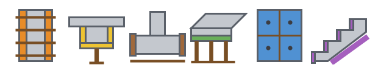
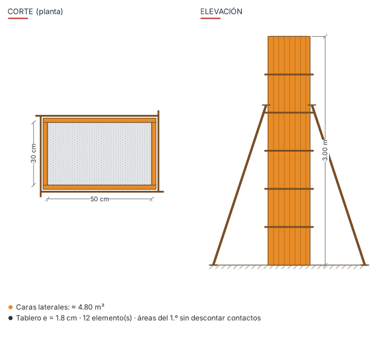
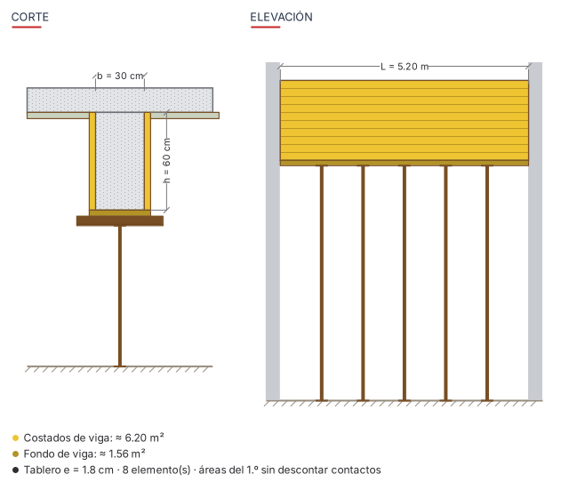
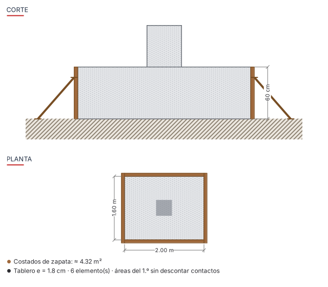
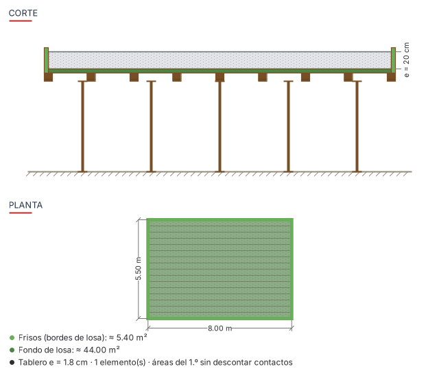
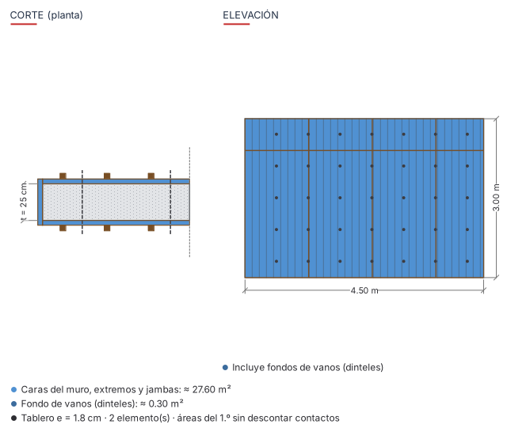
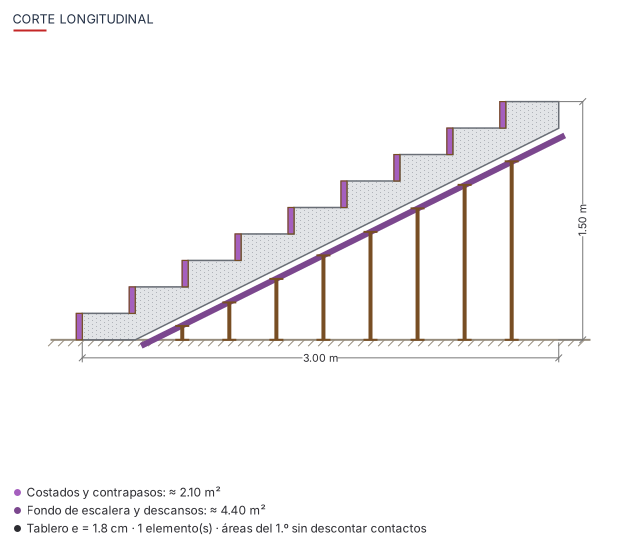
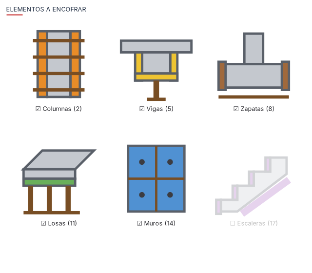

# ACERO Refuerzo y ENCOFRADO para Revit 2024 – 2027

Dos complementos (add-ins) en **C#** para estructuras de concreto armado en Revit:

| Programa | Pestaña | Para qué sirve |
|---|---|---|
| **ACERO Refuerzo** | `ACERO` | Coloca el acero de refuerzo en vigas, columnas, zapatas, losas y muros |
| **ENCOFRADO** | `ENCOFRADO` | Genera los tableros de encofrado de toda la edificación y su metrado en m² |

Se instalan juntos o por separado y comparten el mismo estilo de ventanas y figuras.

---

# 1. ACERO Refuerzo

Coloca acero de refuerzo desde una sola pestaña llamada **ACERO**:

| Botón | Qué arma |
|---|---|
| **Vigas** | Acero corrido superior e inferior con patas en los apoyos, bastones superiores en apoyos e inferiores al centro, estribos cerrados con ganchos de 135° por zonas |
| **Columnas** | Rectangulares (barras por cara, estribo y grapas) **e irregulares**: L, T, cruz, circulares y poligonales (sigue el contorno real) |
| **Zapatas** | Parrilla inferior X/Y con patas y parrilla superior opcional |
| **Losas** | Malla inferior y superior (temperatura) que sigue el contorno real de la losa (Refuerzo de Área) |
| **Muros** | Malla simple o doble, acero vertical con anclaje y empalme, acero horizontal con ganchos |
| **Acero integral** | Menú con las 5 figuras para elegir el elemento |
| **Diámetros** | Crea los diámetros estándar que falten: 6 mm, 8 mm, 3/8", 12 mm, 1/2", 5/8", 3/4", 1", 1 3/8" |

Cada botón tiene su **figurita** en la cinta, y cada ventana muestra la **figura del elemento a escala**.
La figura se redibuja al cambiar cualquier dato: recubrimiento, diámetros, número de barras, separaciones o distribución de estribos.


## Figuras

| Viga | Columna rectangular |
|---|---|
|  |  |

| Columna irregular (L) | Columna circular |
|---|---|
|  |  |

| Zapata | Losa de techo |
|---|---|
|  |  |

| Muro estructural |
|---|
|  |

---

# 2. ENCOFRADO

Pestaña **ENCOFRADO** con un botón por elemento estructural. Cada botón tiene su figurita en la cinta:



| Botón | Caras que encofra (se pueden activar o desactivar) |
|---|---|
| **Columnas** | Caras laterales: rectangulares, **circulares** e **irregulares** (L, T, cruz, polígonos) |
| **Vigas** | Costados y fondo de viga |
| **Zapatas** | Costados: zapatas aisladas, cimientos corridos y losas de cimentación |
| **Losas** | Fondo de losa y frisos (bordes y aberturas) |
| **Muros** | Ambas caras, extremos, jambas y fondos de vanos (dinteles) |
| **Escaleras** | Fondo (losa inclinada y descansos), costados y contrapasos |
| **Encofrar todo** | Todos los elementos de la vista activa o del proyecto, de una vez |
| **Metrado** | Tabla de planificación en Revit y archivo CSV para Excel |
| **Mostrar/Ocultar** | Alterna la visibilidad del encofrado en la vista activa |
| **Eliminar** | Borra el encofrado de los elementos seleccionados, o de todo el proyecto |

## Cómo calcula
1. Lee la geometría real de cada elemento y clasifica sus caras:
   - verticales: costados, frisos, contrapasos;
   - inferiores: fondos;
   - superiores: no se encofran.
2. Extruye cada cara hacia afuera con el **espesor del tablero** (1.8 cm por defecto). Las caras cilíndricas se extruyen como un anillo.
3. **Descuenta las zonas en contacto** con otros elementos (columnas, vigas, losas, muros, zapatas, escaleras):
   - el fondo de losa no se cuenta sobre las vigas y muros;
   - el extremo de una viga no se cuenta dentro de la columna;
   - la base de muros y escaleras no lleva encofrado.
4. Crea los tableros como **Modelo genérico**: una pieza por elemento y tipo de cara, con un color por tipo de elemento.
   Cada pieza lleva los parámetros compartidos `ENC_Elemento`, `ENC_Cara`, `ENC_Area`, `ENC_Nivel` y `ENC_IdElemento`.
5. Al volver a ejecutar, reemplaza el encofrado anterior de esos elementos. Así no se duplica.

Opciones:
- *Solo concreto vaciado en obra* omite elementos de acero, madera y prefabricados.
- *Solo muros estructurales* omite la tabiquería.

## Metrado
El botón **Metrado** crea la tabla **"ENCOFRADO - Metrado"**:
- agrupada por elemento y por cara (con el nivel y el Id de cada elemento);
- con subtotales y total general en m².

Además guarda un **CSV** en *Documentos*, separado por `;` para abrirlo directo en Excel, con el detalle y un resumen.

## Figuras

| Columna | Viga |
|---|---|
|  |  |

| Zapata | Losa |
|---|---|
|  |  |

| Muro | Escalera |
|---|---|
|  |  |

| Encofrar todo |
|---|
|  |

## Limitaciones del encofrado
- Caras curvas que no sean cilindros verticales (por ejemplo, vigas curvas) se omiten; se avisa en el resumen.
- El área es la de contacto con el concreto. No incluye desperdicio, puntales ni andamios.

---

# Instalación (los dos programas)

## Versiones de Revit

Cada programa se compila desde un mismo código para cada versión de Revit, porque Revit cambió de plataforma .NET:

| Revit | Plataforma |
|---|---|
| 2024 | .NET Framework 4.8 |
| 2025 y 2026 | .NET 8 |
| 2027 | .NET 10 |

Las diferencias de la API entre versiones ya están resueltas en el código.
Por ejemplo, Revit 2026 y 2027 reemplazan `RebarHookOrientation` por `BarTerminationsData`.

### Opción A: descargar los complementos ya compilados
1. En GitHub, abra **Actions → Compilar complementos → la última ejecución**.
2. Descargue el artefacto de su versión, por ejemplo `Revit2025-AceroRefuerzo-Encofrado`.
3. Copie su contenido en `%AppData%\Autodesk\Revit\Addins\2025\` para que quede así:
   ```
   Addins\2025\AceroRefuerzo.addin
   Addins\2025\AceroRefuerzo\AceroRefuerzo.dll
   Addins\2025\Encofrado.addin
   Addins\2025\Encofrado\Encofrado.dll
   ```
   Si solo quiere uno de los dos, copie únicamente su `.addin` y su carpeta.
4. Abra Revit y acepte **Cargar siempre** cuando aparezca el aviso de seguridad.

### Opción B: compilar usted mismo
Necesita el [SDK de .NET 8](https://dotnet.microsoft.com/download), y además el SDK de .NET 10 para Revit 2027.
No hace falta tener Revit instalado para compilar: las referencias de la API se descargan de NuGet.

```powershell
.\build.ps1                    # compila los dos programas para 2024, 2025, 2026 y 2027 en .\dist
.\install.ps1                  # copia a las versiones de Revit instaladas
```

Para una sola versión: `.\build.ps1 -Versions 2025` y `.\install.ps1 -Versions 2025`.
Para un solo programa: `.\build.ps1 -Programas Encofrado`.
También puede abrir `AceroRefuerzo.sln` en Visual Studio 2022. La versión de Revit se elige con la propiedad `RevitVersion`, que por defecto es 2025.

## Uso de ACERO Refuerzo

1. Seleccione uno o varios elementos, o pulse el botón y selecciónelos; termine con **Finalizar**.
2. Complete los datos. La figura de la izquierda muestra el armado.
3. Pulse **Colocar acero**. Al final verá un resumen con el número de barras, la longitud total y el peso aproximado en kg.

Los dos programas recuerdan los últimos valores de cada ventana en `%AppData%\ACERORefuerzo` y `%AppData%\ENCOFRADO`.
Cada barra queda marcada en *Comentarios* como `ACERO - …`, para filtrarla o tabularla.

### Distribución de estribos
Se escribe como en los planos y se aplica **desde cada extremo** del elemento:

```
1@5, 10@10, R@20          (centímetros)
1@0.05, 10@0.10, R@0.20   (metros: si todas las separaciones son < 1)
```

Significa 1 estribo a 5 cm, 10 a 10 cm y el **R**esto a 20 cm como máximo. Esto se repite desde ambos extremos.
En columnas, los dos extremos son abajo y arriba, así que se generan las zonas de confinamiento.

### Columnas irregulares
Con **Tipo de armado = Automático**, el programa lee la cara inferior de la columna:
- Si es un rectángulo, usa *barras por cara*.
- Si no (L, T, cruz, círculo, polígono), usa *contorno*:
  - coloca una barra en cada esquina y barras intermedias en cada lado, a la **separación máxima** indicada;
  - en secciones circulares reparte uniformemente, con un **número mínimo** de barras;
  - el estribo es cerrado, sigue el contorno (con arcos reales en los círculos) y lleva ganchos de 135°.

## Requisitos en el modelo (acero)
- Vigas y muros **rectos**. Las columnas deben ser **verticales**.
- Muros y losas con la opción **Estructural** activada; Revit solo permite armadura en anfitriones estructurales.
- Losas: categoría *Suelos*. Zapatas: categoría *Cimentación estructural*, como ejemplar de familia o losa de cimentación.

## Estructura del código

```
src/Comun/                  Compartido por los dos programas: ventana de datos con figura, dibujo, unidades, geometría
src/AceroRefuerzo/
  App.cs                    Pestaña ACERO y botones con sus íconos
  Commands/                 Comandos de Revit y flujo común (selección → ventana → transacción → resumen)
  Modules/                  Un módulo por elemento: Viga, Columna, Zapata, Losa, Muro
  Core/                     Polígonos, distribución de estribos, creación de barras
  UI/                       Figuras del acero, íconos y menú integral
src/Encofrado/
  App.cs                    Pestaña ENCOFRADO y botones con sus íconos
  Commands/                 Comandos por elemento, encofrar todo, metrado, mostrar/ocultar, eliminar
  Core/                     Reglas por elemento, tableros (extrusión + descuento de contactos), parámetros, metrado
  UI/                       Figuras del encofrado e íconos
```

Para agregar otro elemento al acero, cree una clase que implemente `IRebarModule` y regístrela en `ModuleRegistry`.
Para el encofrado, agregue un valor a `Pieza` y sus reglas en `Piezas`.

## Limitaciones conocidas del acero
- Vigas curvas, muros curvos y columnas inclinadas no están soportados.
- En columnas irregulares el estribo es uno perimetral; no se generan estribos interiores ni grapas.
- Losas aligeradas (con viguetas): se arma la losa como maciza.
- Las barras que salen del elemento (anclajes y empalmes) quedan alojadas en el mismo elemento.
